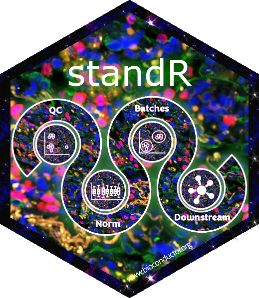

# standR: spatial transcriptomics analyses and decoding in R 

[](https://github.com/DavisLaboratory/standR/actions)
[](https://codecov.io/github/DavisLaboratory/standR?branch=master)
[](https://bioconductor.org/packages/standR/)

The standR package provides a series of functions to assist different stages of the analysis of spatial transcriptomics data generated from the Nanostring's GeoMX DSP platforms. Most functions in the package is based on the infrastructure `SpatialExperiment`, see detials [here](https://www.biorxiv.org/content/10.1101/2021.01.27.428431v3).

## See full guide at [HERE](https://davislaboratory.github.io/standR/)

## Overall workflow


## Example data

The published GeoMX WTA data of diabetic kidney disease that we used in the vignette is available [here](http://nanostring-public-share.s3-website-us-west-2.amazonaws.com/GeoScriptHub/KidneyDataset/).

## Installation

Install the release version from Bioconductor

```
if (!require("BiocManager", quietly = TRUE))
    install.packages("BiocManager")

BiocManager::install("standR")
```

Install development version from GitHub

```
library(devtools)   
devtools::install_github("DavisLaboratory/standR")
```

## Citation

To cite standR, plese cite the following article:
https://doi.org/10.1093/nar/gkad1026
Much appreciated!

